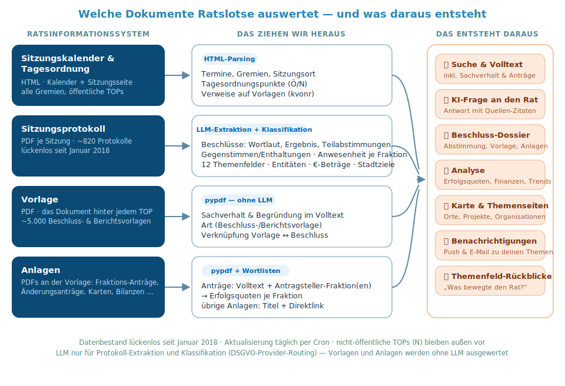

Auswertung der öffentlichen Dokumente des Oldenburger Ratsinformationssystems:
**Sitzungsprotokolle** (→ Beschlüsse, Abstimmungen, Anwesenheit), **Vorlagen**
(→ Sachverhalt & Begründung) und **Anlagen** (→ Original-Anträge der Fraktionen
mit Antragsteller-Erkennung) — durchsuchbar im Web, verknüpft mit den Themen
der Nutzer:innen.



## Faktenlage (an echten Dokumenten verifiziert)

- Vergangene Sitzungen tragen ein **„Protokoll (öffentlich)"-PDF** (`getfile.php?id=…`),
  erkennbar am Label. Veröffentlicht mit Verzögerung (Tage–Wochen).
- Inhalt pro Protokoll: Metadaten (Protokoll-Nr., Datum, Beginn/Ende), **Teilnehmer
  mit Fraktion**, und pro TOP **Beschlusstext + Abstimmungsergebnis** (einstimmig /
  mehrheitlich bei N Gegenstimmen, welche Fraktion, angenommen/abgelehnt/vertagt).
- **Bestand:** lückenlos **seit Januar 2018** (~100 Sitzungen/Jahr, ~820 Protokolle,
  über 7.700 Beschlüsse). Kalendereinträge ohne veröffentlichtes Protokoll (Absagen)
  sind normal und werden bei jedem Lauf erneut geprüft.
- **Vorlagen** (~5.000) tragen ihren Inhalt **nur im PDF** — die `vo0050`-Seite
  liefert bloß Metadaten (Betreff, Nr., Art). Es gibt **keine Vorlagen-Art
  „Antrag"**: Die Original-Anträge der Fraktionen hängen als **Anlagen-PDFs**
  an den Vorlagen.
- **Kosten:** LLM braucht nur die Protokoll-Extraktion ≈ **$0,007/Protokoll**
  (1 Call/Protokoll) und die Klassifikation. Vorlagen und Anlagen werden **ohne
  LLM** ausgewertet (pypdf + Wortlisten) — ihr Backfill kostet $0.

## Datenmodell (`council.sqlite`)

Die Protokoll-Auswertung lebt in drei Tabellen. Sie sind bewusst so geschnitten,
dass spätere Features andocken können (siehe „Forward-looking").

```
council_protocols          -- eine Zeile je verarbeitetem Protokoll
  ksinr PK, document_id, document_url, protocol_nr,
  session_start, session_end, raw_text, n_pages,
  model, extracted_at, status            -- ok | failed

council_decisions          -- eine Zeile je TOP/Beschluss
  id PK, ksinr, position, item_number, title,
  beschluss, outcome,                    -- angenommen|abgelehnt|vertagt|zur_kenntnis|kein_beschluss
  vote,                                  -- einstimmig|mehrheitlich|null
  gegenstimmen, enthaltungen,            -- nullable INTEGER
  factions,                              -- JSON-Array (z.B. ["SPD","CDU","FDP"])
  vorlage_nr, kvonr,                     -- Link zur Vorlage (für später)
  raw_result                             -- Roh-String der Abstimmung

council_attendance         -- eine Zeile je Person je Sitzung
  id PK, ksinr, name, party, role, note  -- role: vorsitz|mitglied|verwaltung|protokoll|gast
```

`raw_text` wird gespeichert, damit wir Protokolle **ohne erneuten Download** mit
besseren Prompts neu auswerten können. Beschlüsse tragen `vorlage_nr`/`kvonr`, damit
sie später mit Vorlagen verknüpfbar sind.

### Vorlagen & Anlagen (`council/vorlagen.py`)

Seither dazugekommen — beide Dokumentklassen werden **ohne LLM** ausgewertet:

```
council_vorlagen           -- eine Zeile je Vorlage (kvonr = SessionNet-Dokument-ID)
  kvonr PK, vorlage_nr, title, art,      -- art: Beschlussvorlage | Berichtsvorlage | …
  document_id, document_url,
  raw_text, n_pages,                     -- pypdf-Volltext (Sachverhalt & Begründung)
  fetched_at, status,                    -- ok | empty | no_pdf | failed
  anlagen_scanned

council_anlagen            -- eine Zeile je Anlage einer Vorlage
  document_id PK, kvonr, label, url,
  is_antrag,                             -- Label-Muster: Antrag/Änderungsantrag/Anfrage
  antragsteller,                         -- JSON, erkannte Fraktionen (Wortlisten, parties_in_text)
  raw_text, n_pages,                     -- Volltext NUR für Anträge
  fetched_at, status                     -- listed | ok | empty | failed
```

- **Beschluss ↔ Vorlage** läuft über `vorlage_nr` (mit Basis-Fallback:
  `22/0348/1` → `22/0348`) — Protokolle liefern nie ein `kvonr`.
- **Antragsteller-Erkennung:** Label zuerst („Antrag der SPD-Fraktion …"), sonst
  erste PDF-Seite; Mehrparteien-Labels („Antrag SPD CDU Grüne FDP") zählen für
  alle. Wortgrenzen verhindern Fehltreffer („Begrünung" ≠ Grüne).
- **Täglicher Rescan** der letzten 45 Tage: Änderungsanträge landen oft erst
  kurz vor der Sitzung auf der Vorlagen-Seite; bereits eingelesene Dokumente
  werden nicht erneut geladen.
- Daraus entstehen: „Aus der Vorlage" + Anlagen-Dossier auf der Beschluss-Seite,
  die **Erfolgsquoten je Fraktion** in der Analyse, Vorlagen-/Antragstext im
  FTS-Index und im Kontext der KI-Frage.

### Beratungsfolge & Personen-Stammdaten (`council/stammdaten.py`)

Drei weitere Seitentypen des Ratsinfos, ebenfalls ohne LLM ausgewertet:

```
council_beratungen         -- eine Zeile je Beratungsstation einer Vorlage
  kvonr, datum, gremium, top, is_public,
  ergebnis,                              -- NULL = geplant/ohne Ergebnis
  ksinr                                  -- Link zur Sitzung

council_persons            -- Mandatsträger (kpenr = SessionNet-Personen-ID)
  kpenr PK, name, fraktion_aktuell       -- Fraktion NUR als aktueller Stand!

council_memberships        -- Gremien-Mitgliedschaften je Person
  kpenr, kgrnr, gremium, rolle, von, bis -- zurück bis 2001
```

- Die **Beratungsfolge** zeigt den offiziellen Weg jeder Vorlage durch die
  Gremien — mit Ergebnis je Station und erst **geplanten künftigen**
  Beratungen. Sichtbar als „Weg der Vorlage" auf den Beschluss-Seiten.
- **Wichtig:** Das Ratsinfo überschreibt Fraktionszugehörigkeiten
  **rückwirkend** mit dem aktuellen Stand (an einem Fraktionswechsler
  verifiziert). Der **Fraktions-Verlauf** einer Person wird deshalb aus
  unseren Anwesenheitsdaten je Sitzung abgeleitet — die Ratsinfo-Fraktion
  dient nur als aktueller Stand.
- Kontaktdaten der Personenseiten (Adresse, Telefon, Beruf) werden bewusst
  **nicht** übernommen.

### Forward-looking (vom Schema vorbereitet)

- **`council_decision_matches`** (owner_id, topic_id, ksinr, decision_id) —
  Beschlüsse gegen Nutzer-Themen klassifizieren (+ strenger Verify-Pass) →
  „Beschlüsse zu deinen Themen" + Benachrichtigung.

## Pipeline

Das Modul **`council/protocols.py`** erledigt drei Schritte:

- das öffentliche **Protokoll-PDF erkennen** (Dokument-Link mit dem Label
  „Protokoll … öffentlich" auf der Sitzungsseite),
- den **Text extrahieren** (pypdf — die PDFs tragen seit 2018 eine Textebene,
  kein OCR nötig),
- **ein LLM-Aufruf je Protokoll** → Metadaten, Anwesenheit und alle Beschlüsse
  als strukturiertes JSON (robust gegen leere Modell-Antworten).

Ein idempotenter Backfill über Datumsbereiche hat den Bestand seit 2018
eingelesen; der tägliche Lauf zieht **neu veröffentlichte** Protokolle nach und
lädt Vorlagen-/Anlagen-Volltexte (inkl. Rescan der letzten Wochen, s. o.).

## Im Web

**`/council` (Ratsinformationssystem)** hat zwei Tabs:

- **„Sitzungen & Tagesordnungen"** — die TOP-Suche über kommende und vergangene
  Sitzungen.
- **„Beschlüsse"** — Volltextsuche mit Filtern (Ausschuss / Datum / Ergebnis /
  Fraktion / Themenfeld).

Die Beschluss-Detailseite zeigt Abstimmung, Anwesenheit, „Aus der Vorlage",
das Anlagen-Dossier und Links zu den Original-PDFs; die Analyse rechnet daraus
u. a. Erfolgsquoten je Fraktion.

## Ausbau-Stand

Daten, Web-UI, Themen-Anbindung (Beschlüsse ↔ Nutzer-Themen mit Verify-Pass
und Benachrichtigung), Vorlagen & Anlagen sowie Beratungsfolge und
Personen-/Gremien-Stammdaten sind produktiv. **Offen:** Redebeiträge (stehen
nicht im Ratsinfo), namentliche Abstimmungen (existieren dort nicht — die
Protokolle bleiben die einzige Abstimmungsquelle).
